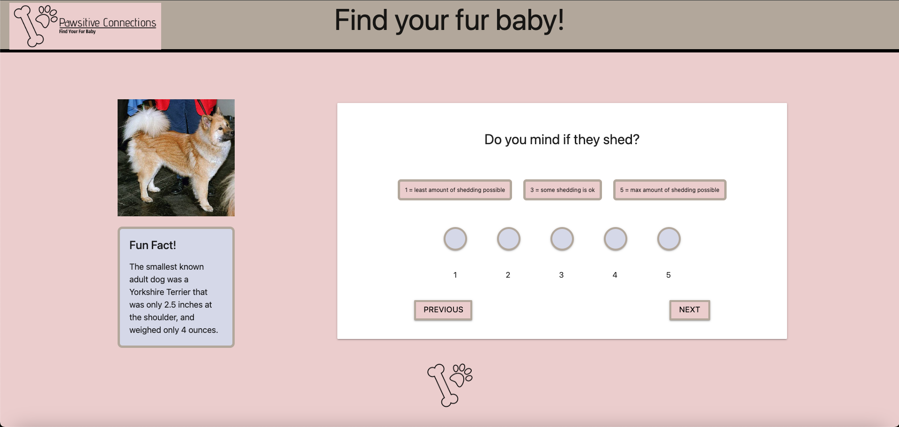

# find-your-fur-baby

## Description

This project, developed by Pawsitive Connections, allows users to take a quiz to determine what breed fits best with the user. With the breed matches, the user can find adoptable dogs in the surrounding area or anywhere in the United States. The dog quiz matches the user with three breeds based on their unique needs, preferences, and lifestyle. The questions include dog attributes such as suitability with children and other pets, shedding, trainability, energy, and barking frequency. Using https://api-ninjas.com/api/dogs, we matched users to over 200 unique dog breeds. Additionally, we used https://dogapi.dog/api/v2/facts to display fun dog facts as the user takes the quiz and https://dog.ceo/api/breeds/image/random to display random dog images. 

Our motivation for this project lies in our deep passion for dogs. We understand some potential dog owners may be hesitant to adopt a dog because they are still determining if a particular breed will suit them. This quiz helps solve this problem because it accessibly matches a potential dog owner with three wonderful dog breeds after a few simple questions. 

As junior developers, we learned a lot while developing this project. We used HTML, CSS, Javascript, jQuery, and the CSS framework materialize to build our website. We learned how to make a functional dynamic quiz with Javascript, interact with several APIs at once, brand, attain persistent data between pages using local storage, and many other things. One of the biggest challenges was developing the quiz logic. Getting decent matches with the user's chosen answers took many iterations and failures. 

## Usage

To use the website, simply go https://pawsitive-connections.github.io/find-your-fur-baby/ . Once there take the quiz, submit, choose the breed that stands out to you the most, and it will take you to the find my fur baby page.

## Credits

Pawsitive Connections - https://github.com/Pawsitive-Connections

Patrick Hennessey - https://github.com/RickHennessey87

## License

MIT License

Copyright (c) 2024 Pawsitive Connections

Permission is hereby granted, free of charge, to any person obtaining a copy
of this software and associated documentation files (the "Software"), to deal
in the Software without restriction, including without limitation the rights
to use, copy, modify, merge, publish, distribute, sublicense, and/or sell
copies of the Software, and to permit persons to whom the Software is
furnished to do so, subject to the following conditions:

The above copyright notice and this permission notice shall be included in all
copies or substantial portions of the Software.

THE SOFTWARE IS PROVIDED "AS IS", WITHOUT WARRANTY OF ANY KIND, EXPRESS OR
IMPLIED, INCLUDING BUT NOT LIMITED TO THE WARRANTIES OF MERCHANTABILITY,
FITNESS FOR A PARTICULAR PURPOSE AND NONINFRINGEMENT. IN NO EVENT SHALL THE
AUTHORS OR COPYRIGHT HOLDERS BE LIABLE FOR ANY CLAIM, DAMAGES OR OTHER
LIABILITY, WHETHER IN AN ACTION OF CONTRACT, TORT OR OTHERWISE, ARISING FROM,
OUT OF OR IN CONNECTION WITH THE SOFTWARE OR THE USE OR OTHER DEALINGS IN THE
SOFTWARE.

## References

https://api-ninjas.com/api/dogs

https://dogapi.dog/api/v2/

https://dog.ceo/api/

https://api.rescuegroups.org/

https://materializecss.com/
